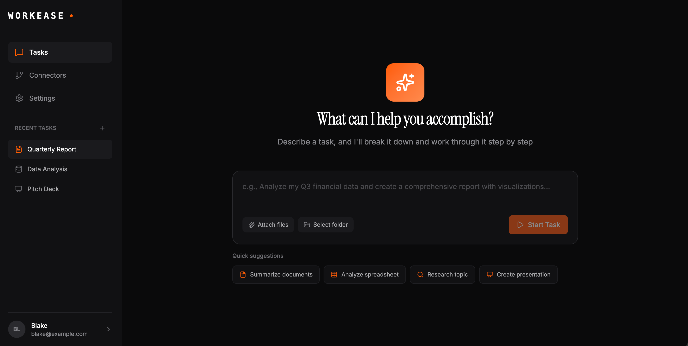
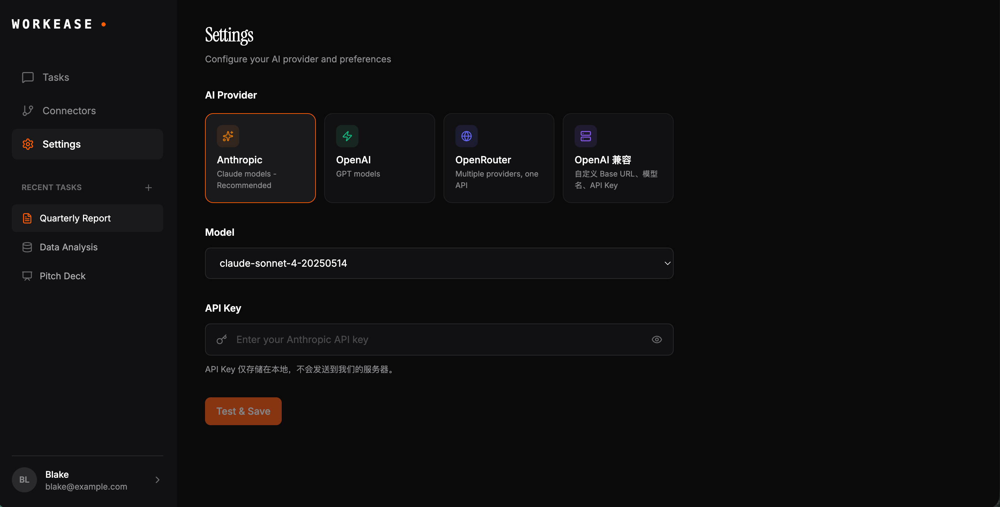
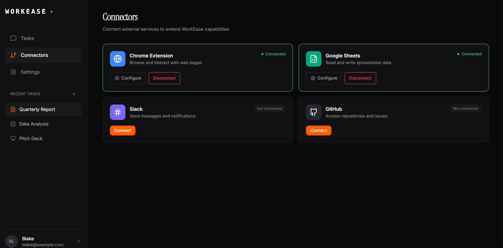

# WorkEase (opensource claude co-work)

<div align="center">

**AI 驱动的桌面智能助手**

[](https://opensource.org/licenses/MIT)
[](https://tauri.app/)
[](https://react.dev/)
[](https://www.rust-lang.org/)

一款基于桌面端的 AI 代理应用，通过自然语言交互执行复杂任务

</div>

---

## 项目简介

WorkEase 是一款现代化的桌面 AI 助手应用。它集成了 Claude Agent SDK，允许用户通过自然语言对话来执行各种复杂任务，包括代码生成、文件操作、工作区管理等。应用采用 Tauri 框架构建，结合了 Web 技术的灵活性和原生应用的高性能。

### 核心特性

- **自然语言交互** - 通过对话界面执行任务，无需学习复杂命令
- **AI 驱动** - 集成 Claude Agent SDK，支持智能任务规划和执行
- **文件操作** - 读写、编辑、搜索工作区中的文件
- **实时反馈** - 流式响应显示，实时跟踪任务进度
- **工作区管理** - 灵活的项目管理和文件组织
- **多模态支持** - 支持多种文件格式（HTML、JSX、代码、文档、图片等）
- **数据持久化** - SQLite 数据库存储会话和任务历史
- **跨平台** - 支持 macOS、Windows 和 Linux

**首页**


**设置**


**连接**


---

## 技术栈

### 前端
| 技术 | 版本 | 用途 |
|------|------|------|
| React | 19.1.0 | UI 框架 |
| TypeScript | 5.8.3 | 类型安全 |
| Vite | 7.0.4 | 构建工具 |
| Tailwind CSS | 4.0.0 | 样式框架 |
| React Router | 7.12.0 | 路由管理 |
| Zustand | 5.0.10 | 状态管理 |
| Lucide React | - | 图标库 |

### 后端
| 技术 | 版本 | 用途 |
|------|------|------|
| Tauri | 2.0 | 桌面应用框架 |
| Rust | 2021 Edition | 系统编程语言 |
| Hono | - | Web 框架 |
| SQLite | - | 数据库 |
| Claude Agent SDK | - | AI 集成 |

---

## 快速开始

### 环境要求

- **Node.js** >= 20.x
- **Rust** >= 1.70
- **pnpm** (推荐) 或 npm/yarn

### 安装依赖

```bash
# 使用 pnpm
pnpm install

# 或使用 npm
npm install
```

### 开发模式

```bash
# 启动开发服务器
pnpm tauri dev
```

应用将在开发模式下启动，支持热重载。

### 构建生产版本

```bash
# 构建应用
pnpm tauri build
```

构建产物位于 `src-tauri/target/release/bundle/` 目录。

---

## 项目结构

```
workease/
├── src/                          # 前端源代码
│   ├── components/              # React 组件
│   │   ├── ui/                  # UI 基础组件
│   │   ├── layout/              # 布局组件
│   │   ├── chat/                # 聊天相关组件
│   │   ├── connectors/          # 连接器组件
│   │   └── agent/               # AI 代理组件
│   ├── pages/                   # 页面组件
│   ├── stores/                  # Zustand 状态管理
│   ├── lib/                     # 工具库和 API
│   ├── server/                  # 后端服务 (Hono)
│   │   ├── routes/              # API 路由
│   │   ├── services/            # 业务逻辑
│   │   └── middleware/          # 中间件
│   ├── db/                      # 数据库相关
│   ├── types/                   # TypeScript 类型
│   └── styles/                  # 样式文件
├── src-tauri/                   # Tauri (Rust) 后端
│   ├── src/
│   │   └── lib.rs              # Rust 命令实现
│   ├── Cargo.toml              # Rust 依赖
│   └── tauri.conf.json         # Tauri 配置
├── package.json                 # Node.js 依赖
├── vite.config.ts              # Vite 配置
└── tsconfig.json               # TypeScript 配置
```

---

## 主要功能

### 1. 任务管理
- 创建和执行自然语言任务
- 实时流式响应显示
- 任务状态跟踪（运行中/已完成/错误/已停止）
- 会话管理和历史记录
- 任务收藏和搜索

### 2. AI 代理能力
- 集成 Claude Agent SDK
- 支持多个 AI 提供商
- 两阶段执行（规划 + 执行）
- 工具使用能力（Read/Write/Edit/Bash/Glob/Grep）
- 权限请求管理

### 3. 文件操作
- 文件读写和编辑
- 工作区文件浏览
- 文件搜索和模式匹配
- 工件管理
- 支持多种文件格式

### 4. 用户界面
- 现代化桌面应用界面
- 响应式设计（最小 1024x600，默认 1440x900）
- 主题支持（亮色/暗色/自动）
- 多语言支持（中文/英文）
- 实时聊天界面

---

## 配置

### 应用配置

应用配置位于 `src-tauri/tauri.conf.json`：

```json
{
  "identifier": "com.workease.app",
  "productName": "WorkEase",
  "version": "0.1.0",
  "window": {
    "width": 1440,
    "height": 900,
    "minWidth": 1024,
    "minHeight": 600
  }
}
```

### 开发端口

- 前端开发服务器：`http://localhost:1420`
- 后端 API：`http://localhost:3001`

---

## 开发指南

### 添加新功能

1. 在 `src/components/` 中创建新组件
2. 在 `src/stores/` 中添加状态管理（如需要）
3. 在 `src/server/routes/` 中添加 API 路由
4. 在 `src-tauri/src/lib.rs` 中添加 Tauri 命令（如需要）

### 代码风格

- 使用 ESLint 进行代码检查
- 遵循 TypeScript 最佳实践
- 组件命名使用 PascalCase
- 工具函数命名使用 camelCase

### 测试

```bash
# 运行测试
pnpm test
```

---

## 贡献

欢迎提交 Issue 和 Pull Request！

---

## 许可证

[MIT](LICENSE)

---

## 联系方式

如有问题或建议，请提交 [Issue](https://github.com/yourusername/workease/issues)。

---

<div align="center">

**用 AI 让工作更轻松** | WorkEase

</div>
